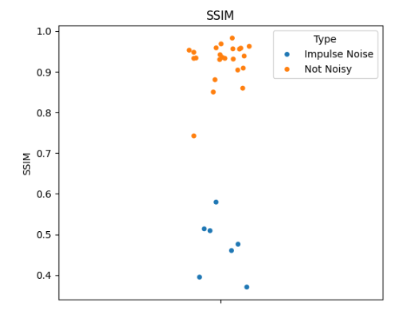
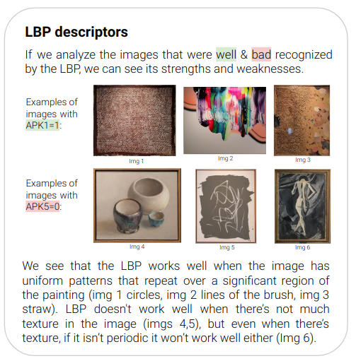

# Week 3
## Task 1. Filter noise with linear or non-linear filters

### Methods to detect noise
Instead of filtering all the images we classified images into **noisy** or **not noisy**. We mainly considered three methods:
**PSNR**, **SSIM** and **Laplacian Operator**.

#### Peak Signal-to-Noise Ratio
This method simplifies the quantification of image degradation by comparing pixel-wise differences.
Although the images were not perfectly clustered, PSNR quantifies pixel intensity differences, making it suitable for evaluating impulse noise.

#### Structural similarity index measure
Perceptual based similarity metric that aligns with human visual perception, considering luminance, contrast and structural similarity.
It effectively cluster the noisy and non-noisy images from the QSD1_W3 dataset.

#### Laplace
Despite the effective clustering achieved with the Laplacian operator, it’s effectiveness is somewhat limited for impulse noise images.
It is sensitive to high-frequency noise, which may result in false positives.

  
  
  

#### Hybrid approach: Threshold with PSNR and SSIM
To sum up we ended up combining PSNR and SSIM metrics by applying specific thresholds (<31.7 dB & <0.7), resulting in a more robust evaluation of image quality. Also, even though Laplace provided better clustering results than PSNR, we excluded due to its sensitivity to structural changes, essential for assessing the impact of impulse noise.

### Noise filtering method
To identify the most effective denoising method for the images the we have detected to be noisy, we used a range of linear and non-linear filters, employing the previously mentioned quantitative measures PSNR and SSIM, and using kernels of sizes 3x3 and 5x5.

For each noisy image in QSD1_W3, we compared the denoised image with the non-augmented original (as shown in Fig. 1). After calculating the averages, we found that linear filters yielded the poorest performance results. Additionally, we noted a slight improvement in performance when computing PSNR with a 5x5 kernel.

While we achieved better PSNR metrics with a 5x5 kernel, we also prioritized SSIM, which performed best with a 3x3 kernel. 

Ultimately, to avoid losing fine details and textures with a bigger kernel, we ended up  considered using a Median filter with 3x3 kernel size as it provided the second-highest PSNR and highest SSIM.

#### Median filtering
**Strengths**

Median filtering can effectively remove this type of noise by excluding this extremes and replacing each noisy pixel with a moderate, representative value from its surrounding neighborhood. It also preserves and enhances edges.

**Limitations**

When noise density is high, a larger window may be needed to capture enough non-noisy pixels, though this comes at the cost of reduced image detail. That’s why we ended up using a 3x3 kernel.

## Task 2. Implement texture descriptors

### Best texture descriptor: DCT
Although we tested LBP (Local Binary Pattern) and wavelets, Discrete Cosine Transform performed best in terms of performance. This is the overall process that we followed:

### Other configurations and descriptors

In this subsection we explain more in depth the different methods and experiments we perormed. LBP discussion:

DCT experimentation:

### Results

The experimentation and the final configuration lead us to the following results.

| Metric | Value  |
|------------|--------|
| map@1 QSD1-W3 (texture, noise removal)  | 0.96   |
| map@1 QSD1-W3 (texture, no noise removal)     | 0.97   |
| map@1 QD1-W3 (color best previous week, noise removal)  | 0.80   |

## Task 3. Detect all the paintings.

In this section of the README we will explain the used algorithm.

1. Preprocessing similar to task 1. We use 3x3 median filter. However now we apply them to all the images.
2. Mean Adaptive Thresholding.
3. Morphological operations. **Closing**, **opening by reconstruction of erosion** and **opening**.

| Metric     | Value  |
|------------|--------|
| Precision  | 0.96   |
| Recall     | 0.97   |
| F1-Score   | 0.96   |

## Task 4. Remove background, apply retrieval system, return correspondences.
1. Get masks after applying the method shown previously.

2. Get coordinates of each component in the mask (x, y, width, height and area) using connectedComponentsWithStats cv2 function and sort components from left to right, top to bottom.

3. Filter out small components based on area, removing any component smaller than a normal painting, such as component C in image 2.

4. Extract and save cropped images of each filtered component using their bounding boxes.